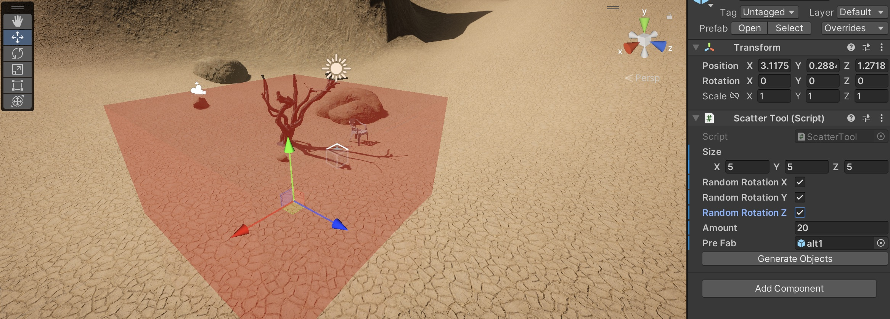

# Session 1 - World Building 

# Working with 3D Assets

To import Assets into your project, just drag and drop them into the "project"/Assets-window

Supported file formats: 
- .fbx (usually works best) 
- .obj 
- .dae
- .3ds
- .dxf

Note: you can also use other file formats (link .blend etc. if the corresponding software is installed but i wouldn't recommend it) 

[Unity Documentation on file formats](https://docs.unity3d.com/2020.1/Documentation/Manual/3D-formats.html)

## Best places to get free 3D-Assets 

- [Unity Asset Store](https://assetstore.unity.com/?category=3d%2Fenvironments&free=true&orderBy=1): Large library of assets, specifically for unity, sometimes with animations 
- [Sketchfab](https://sketchfab.com): Large library for free Assets, also from museums etc., mixed quality & licenses 
- [Polyhaven](https://polyhaven.com/models): Not that many models, but all can be used for any purpose (commercial and personal)
- [Everything library](https://www.davidoreilly.com/library): library of objects from the (very good) game "Everything", see hint below, a lot of models, all in the same style (low poly), can be used in all projects, but an attribution is necessary[license](https://creativecommons.org/licenses/by/4.0/)
- [NASA 3D Models](https://nasa3d.arc.nasa.gov/models): library of space related objects, different quality, but some are quiet nice
- [Three D Scans](https://threedscans.com/): library of 3d scanned statues & some animals, very detailed 
- [ArtStation](https://www.artstation.com/marketplace/game-dev/assets?section=free): Plattform, mixed quality, different
- [Quaternius](https://quaternius.com/): nice low poly packs, most of them free to use
- [OpenGameArt](https://opengameart.org/art-search-advanced?keys=&field_art_type_tid%5B%5D=10&sort_by=count&sort_order=DESC): a lot, mixed quality
- [Dimensiva](https://dimensiva.com/free-3d-models/): mostly furniture

> Trees are rather difficult to render in Unity, so either use Low-Poly Versions, or you can also find some in the Assets Store (e.g. [Realistic Pines](https://assetstore.unity.com/packages/3d/vegetation/trees/realistic-pine-tree-pack-232166), [Polygon Trees](https://assetstore.unity.com/packages/3d/vegetation/trees/polygon-trees-224068))

## Online Sculpting Tools
- [SculptGL](https://stephaneginier.com/sculptgl/)

## Materials/ Shaders/ Textures 

Every 3D-Assets in Unity needs a material that is attached to it, and every material needs a shader. The material is the place where the information like colors and textures are stored. The shader then tells unity how to render these information. (you can compare it to using a pencil: the material stores the color, the shader stores whether it is a wax crayon or a colored pencil). 

Most materials have a certain set of textures (images) applied. The most important ones in Unity are: 
- Albedo/ Base Map
- Specular Map
- Normal Map
- Height Map 
- Occlusion Map

## Create a new material: 

Click on Assets -> Create -> Material

Now you can add some textures and change the colors. 
To apply the material to an object, just drag and drop it onto the object. 

### Best Places to get free Textures: 
- [Polyhaven](https://polyhaven.com/textures)
- [Unity Asset Store](https://assetstore.unity.com/?category=2d%2Ftextures-materials&free=true&orderBy=1)
- [AmbientCG](https://ambientcg.com/)
- [Ponzu (AI generated Textures)](https://www.ponzu.gg)

### Settings for Polyhaven: 

- Resolution: 2K (or on better machine, or complex textures 4K)
- ZIP 
- .JPGs (or for better quality .PNG)

Conversion Table for using Polyhaven Materials: 
| Unity            | Polyhaven   |
| ---------------- | ----------- |
| Albedo/ Base Map | Diffuse     |
| Specular Map     | Spec        |
| Normal Map       | Normal (GL) |
| Height Map       | Displacement|
| Occlusion Map    | AO          |

## Troubleshooting

### Material is displayed pink: 
Probably a problem with the renderpipeline, find the material in the project window, select it and then click on "Edit -> Rendering -> Materials -> Convert Selected Built-in Materials to URP". If this does not work, either create a new material and assign it, or if you can get the asset in a different fileformat try that. 

### Imported object does not have a color/texture 
- See whether the asset comes with a "material" or "texture" folder, if yes, try: 
	- select the 3D-model in the project window, and go to the "Materials"-Tab in the Inspector window, select Location -> Use External Materials (Legacy) and click "Apply"
	- If this does not work: switch to Location -> Use Embedded Materials again and click on "Extract Materials" and then on "Apply". This extract the Materials from the model and you can manually assign the textures/colors etc. 
- If it does not come with an extra folder: 
	- select the asset in the Project window and click on "Extract Textures" and/or "Extract Materials" in the Inspector (in the "Materials" Tab)
	-  If there are still no materials/textures you have to manually create them/ or find a new asset

## How to use "Everything"-models: 
The models are all stored in one fbx-file, in unity visible as one prefab. To get to the single models you have to place the big file in the scene, then right click and select "Prefab - Unpack completely". Then you can choose the models that you need and drag and drop them to the project window, which creates a new prefab with only the models you need.  

> prefab: something like a template, lets you save a costum GameObject with all components, settings, and children as one asset. 

Additionally the colors in the everything models are stored as vertex colors, so you can't see them with a normal shader/material, so we have to build our first shader with shader graph: 
Create -> Shader Graph -> URP -> Lit Shader Graph 
Select the shader in the project window and click on "Open Shader Editor" Unity should now look like this: 

Right click somewhere in the dark area and select "Create Node" and search for "Vertex Color", now connect the Out-Output with the "Base Color"-Input and click "Save". 

Now you can create a new material (Assets -> Create -> Material) and apply the shader to it (select the material in the Project window, go to the inspector and search for the name of your shader in the dropdown "Shader"-Menu). 

> Advanced: [Shader Graph Tutorial](https://www.youtube.com/watch?v=Ar9eIn4z6XE), [The book of shaders](https://thebookofshaders.com/)

**Task: Search for Assets for your world. Already import them into Unity, if something doesn't look as expected see the troubleshoot section, but don't lose too much time on trying to fix single assets.** 

# Building the Terrain & bring in the Assets

## Terrain Tool  

With the Terrain Tool, you can very easily create landscapes and add vegetation. You can find a good tutorial here: 
[How to build beautiful landscapes in Unity using Terrain Tools | Tutorial](https://www.youtube.com/watch?v=smnLYvF40s4)

### Vegetation that work with the Terrain Tool: 

Since not all Vegetatation-Assets work with the terrain tool, here are some i found that work: 

- [Samples Assets from Unity](https://assetstore.unity.com/packages/3d/environments/landscapes/terrain-sample-asset-pack-145808): Very big (1.6GB), different Textures, Vegetation 
- [Polygon Trees](https://assetstore.unity.com/packages/3d/vegetation/trees/polygon-trees-224068): Low Poly, no Wind
- [Realistic Pines](https://assetstore.unity.com/packages/3d/vegetation/trees/realistic-pine-tree-pack-232166)

- Grass/Flowers: https://assetstore.unity.com/packages/2d/textures-materials/nature/grass-flowers-pack-free-138810

> Other (commercial) Tool [Gaia Pro](https://assetstore.unity.com/packages/tools/terrain/gaia-pro-2021-terrain-scene-generator-193476)

## Probuilder 

With Probuilder you can quickly build simple geometric forms directly in unity. 

[ProBuilder Tutorial](https://www.youtube.com/watch?v=YtzIXCKr8Wo)

## Scatter Tool: 

Place a certain amount of objects at random positions (and random rotations) in your scene. 

## Grid Tool: 

Place a certain amount of object in a grid (and random rotations) in your scene. 

Instructions: 
1. Create Empty GameObject (GameObject -> Create Empty)
2. Go to Inspector-Window -> Add Component -> Search for "Grid Tool" or "Scatter Tool"
3. Enter the amount, distance etc. & drag your Prefab into the Prefab box 
4. Click on "Generate Objects"

> Good place to get started with coding in Unity: [catlikecoding](https://catlikecoding.com/unity/tutorials/)

**Task: Place all of your assets in the scene and build a terrain or the basic structure of your scene with ProBuilder.**

# Lighting the Scene

## Realtime Lights 
Realtime lights calculate the lightrays in realtime, that means you can move the lights, move the object that catch shadows from the light without any prerendering. 

There are three types of lights: Spotlight, Pointlight, Directional ligth

## Baked Lights
For more advanced lighting you can bake your light, that means you prerender your lightmap which is then like a fixed texture on the object. You can't move the light source or the objects that get illuminated without recalculating the light. 

Two examples for baked lights are: area lights and skyboxes. 

To see the effect of a baked light, you have to set the object to static which you want to illuminate: 
Select the object in the hierarchy and select Static -> Contribute GI 

Then go to the "Lighting"-window (Window -> Rendering -> Lighting) and click on "Generate Lighting" (make sure the "Auto-Generate"-Box is not ticked)

## Skyboxes 
Skyboxes can be used to very easily create a complex lighting (and background) for a scene. It's basically a sphere around the scene that is filled with a texture, that illuminate the scene. 

To use a skybox go the lighting window (Window -> Rendering -> Lighting) and select the skybox material: 

(Note: You have to click on "Generate Lighting" and your Objects need to be static)

Best places to find skyboxes: 
- [Polyhaven](https://polyhaven.com/hdris)
- [Unity Asset Store](https://assetstore.unity.com/2d/textures-materials/sky)

### Importing a skybox (from Polyhaven)
Download the skybox as .exr (i would recommend 4k resolution, if you wanna see the skybox in the background, if not 1k should be enough). 

Import to Assets, then select the image in the Project Window and go to the inspector and select texture shape -> 

Then create a material (Assets -> Create -> Material) go the inspector and search for "Cubemap" in the shader dropdown. 

Then you can drag and drop the image that you imported in the cubemap area. 

Now you can use the skybox in the lighting settings. 

## Fog

There are multiple ways to create Fog in Unity, the easiest is the built-in Fog in the Lighting window (Window -> Rendering -> Lighting)

Just click on Fog and select a color and density. 

**Add lighting to your scene**

