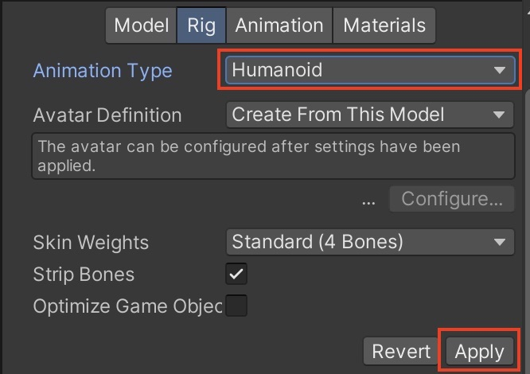

# Session 2 - Virtual Filmmaking 

# Animations 

## Animations window 

To animate an object, open the "Animation" window (Window -> Animation -> Anmation). 
Then select the GameObject you want to animate in the hierarchy window, now you should see this in the Animation Window: 

Click on "Create" this creates an *Animation Clip*.

Now you can start to animate your object either by hitting the record button:

or by manually adding the properties and keyframes: 

See also:
- [Tutorial Animation in Unity](https://learn.unity.com/tutorial/working-with-animations-and-animation-curves#)

By default the Animation will loop, if you only want it to play once select the Animation Clip in the Project window and untick "Loop Time" in the Inspector. 

> This method works best when you want to animate a single objects, like a spinning light. If you want to animate multiple objects together and the timing is importing, like for example a cinematic scene, or a transition scene then the "Timeline"-feature works better. 

## Animator window

*Note: we don't need the animator window for our course, but it's easier to understand the Unity Animation system if you know about it* 
The Animator selects when your animation clips will be played, for example when you want to create a Character that has different states (like walking, standing, running) and one animation clip for each state you would animate this in the Animator window (in general: non-linear animations). In this case you would need a little bit of coding, you can find a tutorial here: 
https://www.youtube.com/watch?v=tveRasxUabo

## Timeline

The Timeline works best if you want to create a linear sequence of animations, like a transition scene or in our case a little movie sequence. 

To work with the Timeline open the Timeline window (Window -> Sequencing -> Timeline). 
Then create an empty GameObject (GameObject -> Create Empty) and name it "Director", this GameObject will control our movie sequence (and also our cameras later). 

> You can click on the settings wheel on the upper right side and choose whether you wanna work in seconds or in frames. 

### Activating Objects in the Timeline
With the timeline you can easily activate and deactivate objects. Right-click on the left side of the Timeline window and select "Activation Track" then drag and drop the GameObject you want to activate and deactive in the selector field. 

You can also change the time when and for how long your object should be active

### Animate Objects
You can also animate object in the same way as in the Animation window, but in the Timeline window you can directly see the timing for the whole scene, in case the animation should happen at a specific point in time. 
Right click on the left side again and select "Animation Track" (always make sure that the "Director" GameObject is selected in the hierarchy) then drag and drop the object you want to animate in the selector field and click on record. 

> Here you can find some information about the other tracks you can use with the timeline: [Overview of the Timeline-Features](https://lukeduckett.medium.com/it-all-comes-down-to-timing-a-quick-guide-to-timeline-in-unity-fd96b26820f4),[Control Track](https://christopherhilton88.medium.com/what-is-a-control-track-in-timeline-f70588662cce), [Signal Track](https://blog.unity.com/technology/how-to-use-timeline-signals), [Playable Track](https://docs.unity3d.com/2018.3/Documentation/ScriptReference/Timeline.PlayableTrack.html)

# Cinemachine 
With Cinemachine you can create complex camera behaviours without coding, like following a target, switching between different cameras, blending camera positions etc. 

## Virtual Cameras
Cinemachine works with so called *Virtual Cameras*. GameObjects that tell the MainCamera how to behave, so its always important, that you still have a normal camera (GameObject -> Camera) in your Scene. You can create Virtual Cameras by clicking on GameObject -> Cinemachine -> Virtual Camera this will add a GameObject called "CM vcam1" in your scene, this GameObject now controls the position of the Main Camera. 

## Blending/ Switching between two virtual cameras
Lets create two virtual Cameras and switch between them in the Timeline: 
Create another Virtual Camera and position both cameras in different spots, so move the CM vcam1 & CM vcam2 GameObject in the Scene View.

> To get a preview of what the cameras see switch to Game view, i would suggest to split the window that you can see the scene view and the game view at the same time: 

To Switch between the cameras in the preview you can just click on "Solo" in the inspector, when you select the virtual camera you want to preview. 

The next step is to switch between the cameras in the Timeline, so select the *Director*-GameObject again and and drag and drop the Main Camera in the left field of the Timeline window and select "Add Cinemachine Track". Now you can drag and drop you virtual cameras in the Cinemachine Track and arrange them: 

If you overlap the two virtual cameras Unity with blend between the two positions: 

## Looking at a target 
Cinemachine cameras can also automatically look at a moving target: Select the Virtual Camera and drag and drop the moving GameObject in the "Look At" field. 

## Following a target
The same also works for following a target: Select the Virtual Camera and just drag and drop the target in the "Follow" field. 

## Dollytrack 

You can also create a Dolly to control the movement of your Virtual Camera. Go to GameObject -> Cinemachine -> Dollytrack with Cart. 

Now you can change the Path of the Dolly Track when selecting the DollyTrack Gameobject: 

And adjust the speed when selecting the DollyCart-GameObject: 

Then create a new Virtual Camera (GameObject -> Cinemachine -> Virtual Camera) and select the DollyCart-GameObject as the follow target. In the Body-section you can then select "Tracked Dolly", drag and drop your Path (the DollyTrack-GameObject) and enable the Auto Dolly Feature: 

When you press play, the Virtual Camera should follow your Dolly Cart. 

# Flycam and other ways to control your virtual camera

Since we are producing our film in real-time you can also create the camera movement on the fly, while recording. There are multiple plugins, a simple one is this one:
- [Free Fly Camera](https://assetstore.unity.com/packages/tools/camera/free-fly-camera-140739#reviews) 
This lets you control the camera with the arrow-keys and the mouse, so you can fly through your virtual scene to record your film. 

Another more advanced plugin is the [Unity Virtual Camera App](https://apps.apple.com/us/app/unity-virtual-camera/id1478175507). This allows you to control your virtual camera with your phone. 

# Post Processing 

Post Processing allows you to add multiple camera effects to your output image, like color grading, bloom, motion blur, etc. 

To use the effects first create an empty GameObject and add the "Volume" Component to it: 

Then create a new profile: 

And add the effects with "Add Override": 

To see the effects make sure that "Post Processing" is activated on your *(Main) Camera*: 

> There are also a lot of post-processing effects on github just make sure that you select the correct *render pipeline* (we currently the universal render pipeline (URP)). 

# Recording

The easiest way to record videos is the *Unity Recorder* (Window -> General -> Recorder -> Recorder Video). Then click on "Add Recorder" and choose "Movie", here are the preferences that i recommend: 

*Please make sure that the path you selected is not inside your Unity project*

> If you can't find the Recorder in your Unity Project you can install it via the Package Manager: Window -> Package Manager. For the packages (upper left corner) choose "Unity Registry", search for "Recorder" and click "Install"

> The recorder also offer the possibilty to record 360°-video. In this case use at least 4k as a resolution. 

> If the image quality is not good enough you can export an image sequence (e.g. .PNG) and then create the video in Premiere or in other video editing softwares. 

# Sound 

To add sound to a scene create a new Audio Source: GameObject -> Audio -> Audio Source. 

Then drag and drop your soundfile. 

- [Tutorial: Sound Component in Unity](https://learn.unity.com/tutorial/working-with-audio-components-2019-3)

Supported file formats: 
- AIFF 
- WAV 
- MP3
- Ogg 

Places to get free sounds: 
- [freesounds.org](https://freesound.org/people/Nox_Sound/): Different licenses
- [OpenGameArt](https://opengameart.org/art-search-advanced?field_art_type_tid%5B%5D=13)
- [Soundcloud](https://soundcloud.com/)

> Tutorial how to work with Audio Tracks in the timeline: [Unity Learn: Audio and the Timeline](https://learn.unity.com/tutorial/working-with-audio-tracks-in-timeline#5f6126e3edbc2a0020034db9)

# <a name="mixamo">Mixamo

Mixamo offers a lot of Characters and Animations: https://www.mixamo.com

To import in Unity: select character and animations and click on "Download", then choose these settings.

Import the fbx-file in Unity, select it in the project window and adjust the import settings: 

1. Extract textures -> Tab "Materials" -> Extract Textures...

2. Make sure the Animation is looped -> Tab "Animation"

3. Make sure the Rig is humanoid -> Tab "Rig" -> and Click on "Apply"

4. Drag and Drop the Animation on the object in the hiearchy

When you now enter the Play Mode your characters should look and move like the one in mixamo.

