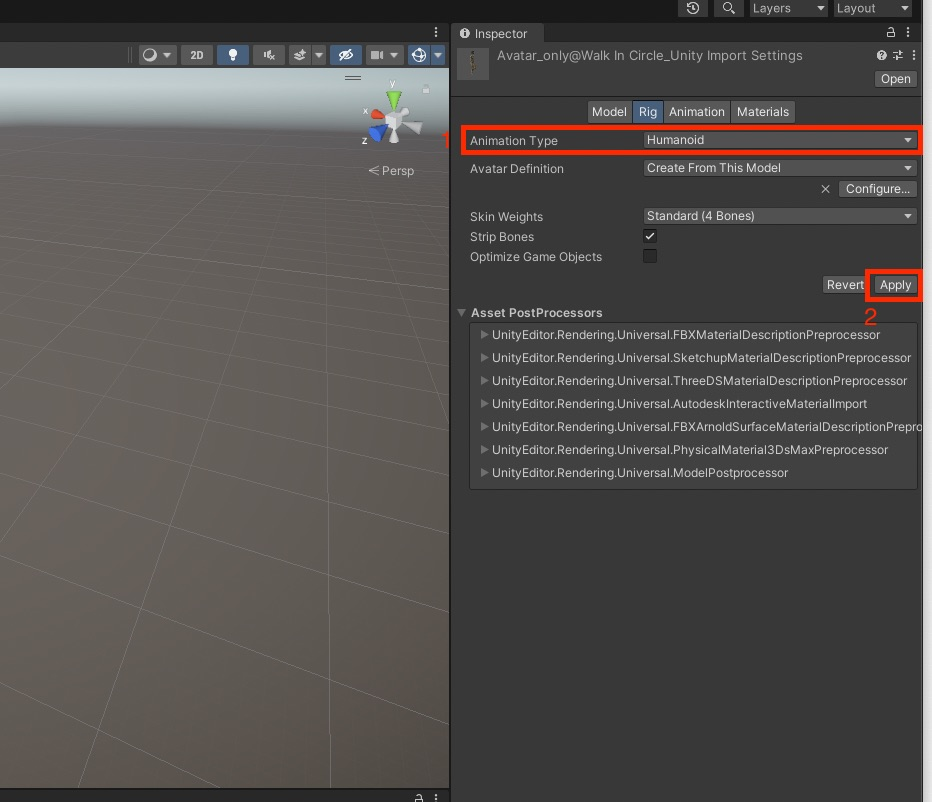

# Session 3 - Putting the pieces together

# Importing from Clo3D 

## Dataflow 

What you need from Clo3D and Mixamo: 
- .fbx-file (only character with animation, without garment; from Mixamo; "FBX for Unity")
- .dae-file (only garment with baked animation from Clo3D)
- .png-Texture (baked diffuse map from Clo3D; if needed also normal-map (in case you are working with structures in the fabric) & metallic-map(in case you are working with reflections))

### 1. Importing the .fbx from mixamo 

1. Drag and Drop the .fbx-file from Mixamo (only character with animation, without garment; from Mixamo; "FBX for Unity") in the Unity project window
2. Select the file in the project-window and select the "Rig"-Tab in the Inspector
	- Change Animation Type to "Humanoid"
	- Click on "Apply"
	
3. If you want a looped Animation: Select the Animation Tab and Check "Loop Time"
		
4. Go to the Materials Tab and click on "Extract Textures..."
5. In the Materials Tab click on "Extract Materials..."
		
6. (Optional) If you want to change the size of the pattern on your Avatar: 
	- you should now see the Materials of you Avatar in the "Project Window", select the Material change the "Tiling"-value
			

### 2. Importing the .dae from Clo3D 
- Import .dae-File 

### 3. Importing & applying the texture

### 4. Create Timeline Asset