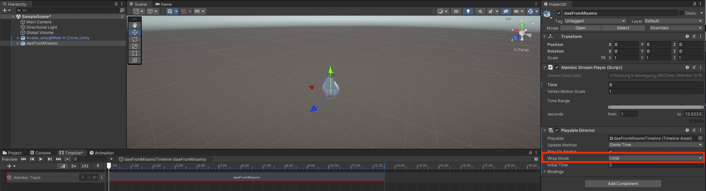

# Session 3 - Putting the pieces together

# Importing from Clo3D 

## Dataflow 

What you need from Clo3D and Mixamo: 
- .fbx-file (only character with animation, without garment; from Mixamo; "FBX for Unity")
- .abc-file (only garment with baked animation from Clo3D)
- .png-Texture (baked diffuse map from Clo3D; if needed also normal-map (in case you are working with structures in the fabric) & metallic-map(in case you are working with reflections))

### 1. Importing the .fbx from mixamo 

1. Drag and Drop the .fbx-file from Mixamo (only character with animation, without garment; from Mixamo; "FBX for Unity") in the Unity project window
2. Click on the imported file in the project window and open the Inspector window (if it is not shown automatically). 
2. (Optional) If you want a looped Animation: Select the Animation Tab and Check "Loop Time"
		
3. Go to the Materials Tab and click on "Extract Textures..."
4. In the Materials Tab click on "Extract Materials..."
		
5. (Optional) If you want to change the size of the pattern on your Avatar: 
	- you should now see the Materials of you Avatar in the "Project Window", select the Material and change the "Tiling"-value
			
6. Drag & Drop the Character in your scene and _make sure that the position of the GameObject is set to 0,0,0)_ 
7. Apply the animation to the character: 
	- In the Project window: Click on the small arrow on the right side of your Avatar
	- Drag and Drop the Animation (the triangle symbol) on the character in your scene
	
8. When you turn on the Play-Mode now your character should move. 

### 2. Importing the .abc from Clo3D 
1. Install the Alembic-Package:
	- In the Taskbar go to "Window -> Package Manager"
	
	- Change Packages to "Unity Registry", search for "Alembic", select the pacakge and click on "Install"
	
2. Import (Drag & Drop) the .abc-file in the project-window 
3. Drag & Drop the imported garment in your scene and _make sure that the position of the GameObject is set to 0,0,0)_ 

### 3. Importing & applying the texture
1. Import the texture from Clo3D into Unity (Drag & Drop the .png in the project window)
2. (Optional) If you are working with transparency, select the imported .png in the project window, and make sure that "Alpha is Transparency" is selected in the Inspector
	
3. Create a new Material (In Project window: Right Click -> Create -> Material) and apply the Material to the child-object of the garment-GameObject in the Scene
	
4. drag & drop the imported texture in the "Base Map"-field 
	
5. (Optional) If you are working with transparency make sure that the "Surface Type" is set to "Transparent" on the material. 

### 4. Create Animation for the garment
1. Select the Garment-GameObject and open the Timeline-Window ("Window -> Sequencing -> Timeline")
2. Click on "Create"
	- 
3. Drag & Drop the Garment-GameObject on the right side of the Timeline-Windows and select "Add Clip with Alembic Track", move the Clip to the beginning of the timeline and adjust the length (the Clip snaps when you reached the end)
	- 
4. (Optional) When you want a looped animation make sure that the "Wrap-Mode" of the Playable-Director on the Garment-GameObject is set to "Loop"
	- 

When you now hit "Play" the Garment and the character should move at the same time

#  Merging Scenes 

> Make sure to always make a copy (duplicate the whole folder) of the Unity project before you start merging scenes. 

## Export Scene
You can find a step by step tutorial here: 
[Export Scenes in Unity](https://vionixstudio.com/2021/10/25/export-a-scene-in-unity/)

## Import Scene 

In the Taskbar go to: Assets -> Import Package -> Costum Package

## Merge 
Then you can open both scenes (drag & drop the scene in hierarchy window of the opened scene) and drag & drop the objects that you need to your new scene: 

